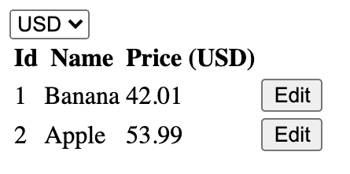

## Instructions

For this assignment, please create the following UI. You can use any library but preferably React.

Visual appearance is not important but the UI should have the following functionality:
- Display a list of products with their information.
- Click on the edit button to bring up a form to modify product information and save.
- Change the currency in the dropdown and the UI then displays prices in the specified currency.

 If you are also completing the API assignment, then the UI should be connected to the API you're building. That is, the list of products should come from API response and updates to the product information should be saved to the database.
 
 If you are you only completing the UI assignment, you can use mock data.
